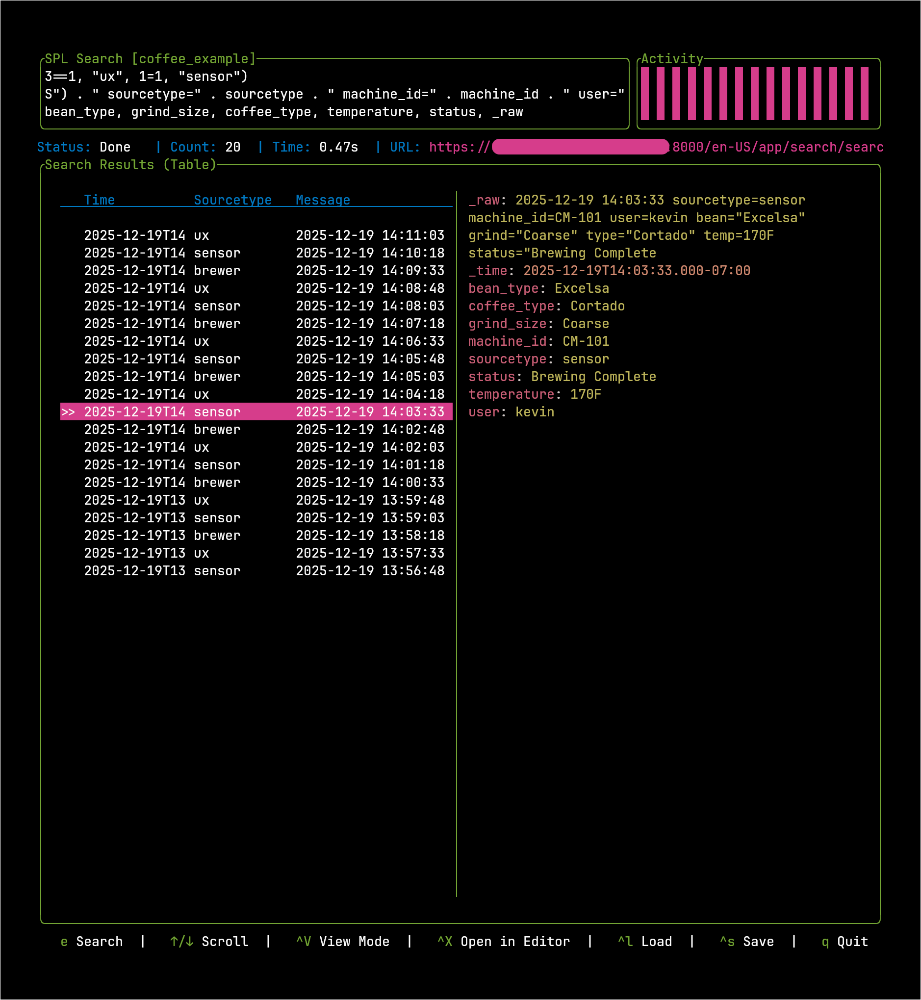

# Splunk TUI



A modern, high-performance terminal user interface for interacting with the Splunk Platform. Built in Rust with `ratatui`, it provides a keyboard-centric workflow for running searches, managing jobs, and analyzing results without leaving your terminal.

## Key Features

- **SPL Editor**: Multiline search editor with Vim-mode support (`Ctrl+v`), external editor integration (`Ctrl+x`), and local search history.
- **Job Management**: Real-time monitoring of search progress, event counts, and job status.
- **Result Explorer**: Interactive viewing of search results with JSON syntax highlighting.
- **Saved Searches**: Save and load your frequent queries locally (`Ctrl+w` / `Ctrl+s`).
- **Theming**: Toggle between multiple built-in themes including a Splunk-inspired palette (`t`).
- **Performance**: Extremely low footprint and responsive UI, even with large result sets.

## Installation

### From Source

Ensure you have [Rust and Cargo](https://rustup.rs/) installed:

```bash
git clone https://github.com/christian-taillon/spelunktui.git
cd spelunktui
cargo install --path .
```

This will compile the binary and install it into your Cargo bin directory (usually `~/.cargo/bin`), which is typically in your system's `$PATH`. You can then run the app by simply typing `splunk-tui` in your terminal.

## Configuration

The application can be configured via environment variables, a `.env` file, or a `config.toml` file located in your system's config directory (e.g., `~/.config/splunk-tui/config.toml`).

### Environment Variables / .env

Copy the example file and fill in your details:
```bash
cp .env.example .env
```

| Variable | Description |
|----------|-------------|
| `SPLUNK_BASE_URL` | Your Splunk instance URL (e.g., `https://splunk.example.com:8089`) |
| `SPLUNK_TOKEN` | A valid Splunk Authentication Token |
| `SPLUNK_VERIFY_SSL` | Set to `false` if using self-signed certificates (default: `true`) |

## Keybindings

Splunk TUI is designed for keyboard efficiency. Press `Ctrl + /` in the app to view the full help modal.

### General
- `Ctrl+/`: Show Help
- `q`: Quit
- `e`: Enter Search Input Mode
- `t` or `Ctrl+t`: Cycle Themes

### Search Editor
- `Enter`: Run Search
- `Shift+Enter` or `Ctrl+j`: New line (Standard mode)
- `Ctrl+v`: Toggle Vim Mode (Normal/Insert)
- `Ctrl+x`: Open search in external `$EDITOR`
- `Esc`: Exit to Navigation mode

### Results & Navigation
- `h`, `j`, `k`, `l` or Arrows: Navigate results
- `Ctrl+j` / `Ctrl+k`: Fast Scroll
- `Ctrl+r`: Clear Results
- `Ctrl+l`: Load Saved Search
- `Ctrl+s`: Save Current Search
- `Shift+e`: Open search job in browser
- `Ctrl+v` or `Ctrl+m`: Toggle Raw/Table View
- `Ctrl+x`: Open Results in External Editor
- `/`: Local Regex Search
- `n` / `N`: Next / Previous match in Local Search

### Pane Navigation
- `Tab`: Cycle Focus (Search > List > Detail)
- `h` / `l` or `Left` / `Right`: Focus Panes (List vs Detail)

## License

Distributed under the GNU General Public License v3.0. See `LICENSE` for more information.