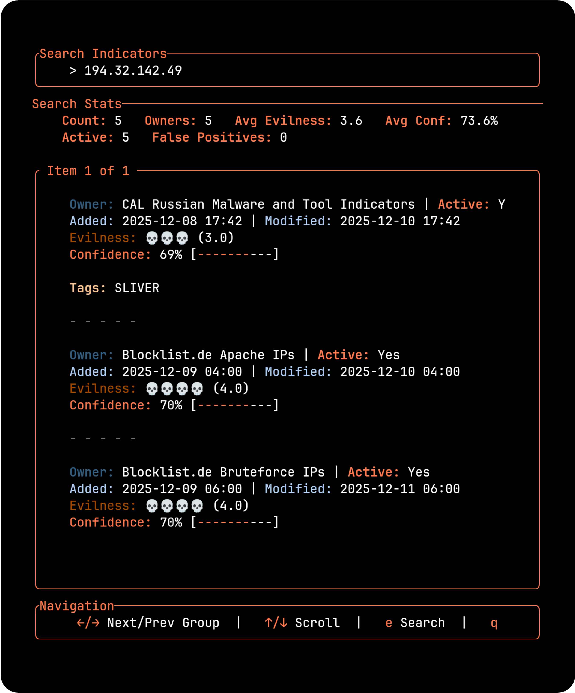

# Splunk TUI



A modern, terminal-based user interface for interacting with the Splunk Platform. This tool provides a keyboard-centric, efficient way to run searches, view results, and manage your Splunk jobs directly from your terminal.

## Features

*   **Fast & Efficient**: Built in Rust for performance and low resource usage.
*   **Keyboard Navigation**: Vim-like keybindings for rapid interaction.
*   **Detailed Views**: Inspect search results with syntax highlighting and structured data views.
*   **Search**: Powerful SPL search capabilities to find what you need quickly.

## Prerequisites

*   **Rust**: You need to have Rust and Cargo installed. You can install them via [rustup](https://rustup.rs/).
*   **Splunk Credentials**: You need a Splunk Base URL and Authentication Token.

## Installation

1.  **Clone the repository:**

    ```bash
    git clone https://github.com/PicoMitchell/splunk-tui.git
    cd splunk-tui
    ```

2.  **Configure Credentials:**

    Copy the example environment file and add your credentials:

    ```bash
    cp .env.example .env
    ```

    Edit `.env` with your preferred editor and fill in your details:

    ```env
    SPLUNK_BASE_URL=https://your-splunk-instance:8089
    SPLUNK_TOKEN=your_splunk_token
    # Optional
    SPLUNK_VERIFY_SSL=true
    ```

    > **Note:** This application has been tested on Linux so far. Mac and Windows support to follow.

## Usage

### Using Cargo (Recommended)

To run the application directly with Cargo:

```bash
cargo run
```

### Using NPM

If you prefer using NPM scripts (e.g., in a mixed environment), we provide a wrapper:

```bash
npm install
npm start
```

## Keybindings

*   **Navigation**: `h`, `j`, `k`, `l` (Left, Down, Up, Right) or Arrow Keys.
*   **Select/Enter**: `Enter`.
*   **Back/Escape**: `Esc`.
*   **Quit**: `q` or `Ctrl+c`.
*   **Theme Toggle**: `t`.

## Development

The project is structured as a standard Rust binary crate.

*   **Run Tests**: `cargo test`
*   **Build Release**: `cargo build --release`

## Legacy Python Tool

The previous Python-based CLI tool has been moved to the `legacy/` directory.
